## ⚡ Quick Install (recommended)

One command installs everything FLUJO needs (Git, Node.js, Python, uv), clones FLUJO, builds it, and sets up a global `flujo` command. This is the recommended way to run FLUJO — MCP servers get all their runtimes too.

**Windows** — press Start, type powershell, press Enter, copy & paste the command below and press Enter again:

```powershell
irm https://raw.githubusercontent.com/mario-andreschak/FLUJO/main/scripts/install.ps1 | iex
```

**Linux / macOS** — paste into a terminal:

```bash
curl -fsSL https://raw.githubusercontent.com/mario-andreschak/FLUJO/main/scripts/install.sh | bash
```

**Already have Node.js?** You can also skip installation entirely and run a prebuilt FLUJO straight from npm — fastest start, but MCP servers may still need `git` / `python` / `uv` on your PATH (see [Run via npx](#run-via-npx-npm-package)):

```bash
npx flujo-ai
```

Prefer to set it up manually? See [Getting Started](#-getting-started). To remove FLUJO later, see [Uninstalling](#uninstalling-windows).

## A few words in advance

For *anything* that you struggle with (MCP Installation, Application Issues, Usability Issues, Feedback): **PLEASE LET ME KNOW!**
-> Create a Github Issue or write on Discord (https://discord.gg/KPyrjTSSat) and I will look into it! Maybe a response will take a day, but I will try to get back to each and every one of you.

### FLUJO animated Short #1 — "A sad song about MCP"

[](https://www.youtube.com/watch?v=boOS9XHQdZc)

# FLUJO

[](LICENSE)
[](package.json)

FLUJO is an open-source, local-first platform for building **MCP-powered AI workflows**. It brings together model management, Model-Context-Protocol (MCP) servers, a visual flow builder, and a chat interface in one app — so you can wire models and tools together, run them headlessly on triggers, and expose the result to other apps, without giving up control of your keys and data.

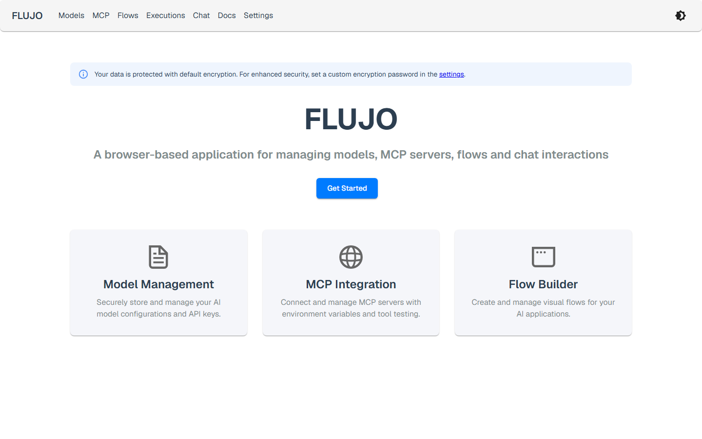

FLUJO is powered by the [PocketFlow Framework](https://the-pocket-world.github.io/Pocket-Flow-Framework/) and built with Cline, Claude Code and a lot of LOVE.

## 🌟 Key Features

### 🔑 Secure Environment & API Key Management

- **Encrypted at rest**: API keys and other secrets are encrypted in local storage, with an optional custom encryption password for extra protection
- **Never sent to the browser**: secrets stay server-side — the frontend only ever sees a masked placeholder, even in your own DevTools
- **Global variables, bound anywhere**: define a key once (e.g. `openrouter_key`) and bind it into any model or MCP server config instead of pasting it repeatedly
- **Backup & restore** your encrypted store from the Settings page

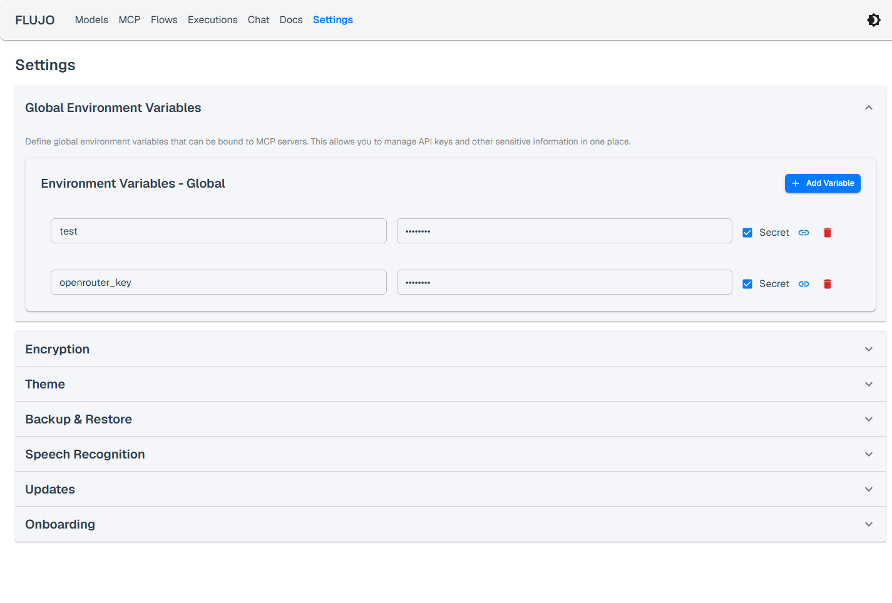

### 🤖 Model Management

- **Multiple providers**: OpenAI, Anthropic (native or OpenAI-compatible), Google Gemini, X.ai (Grok), OpenRouter, and local models via Ollama
- **Claude Subscription**: use your Claude Pro/Max plan directly (via the Claude Agent SDK) instead of a metered API key
- **Per-model system prompts** and tunable parameters, reused across any flow

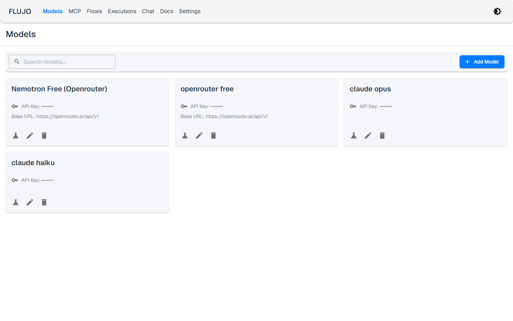
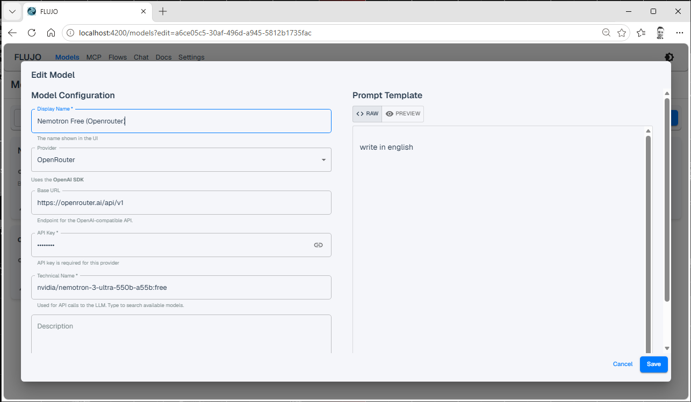

### 🔌 MCP Server Integration

- **Install from anywhere**: the **Marketplace** tab searches the official [MCP Registry](https://registry.modelcontextprotocol.io) and installs with one click; **Spotlight** curates servers verified to work well with FLUJO; or install manually from a GitHub repo / local folder
- **Full MCP capability support**: tools, resources, prompts, roots (workspace folders), and sampling (let a server borrow one of your models under a trust policy you control)
- **Tool inspection & testing**: browse and call a server's tools, resources, and prompts straight from its detail view
- **FLUJO as an MCP proxy**: re-expose any server you've configured in FLUJO to other MCP clients (Claude Desktop, Cursor, Cline, …) over Streamable HTTP — configure a server once, use it everywhere

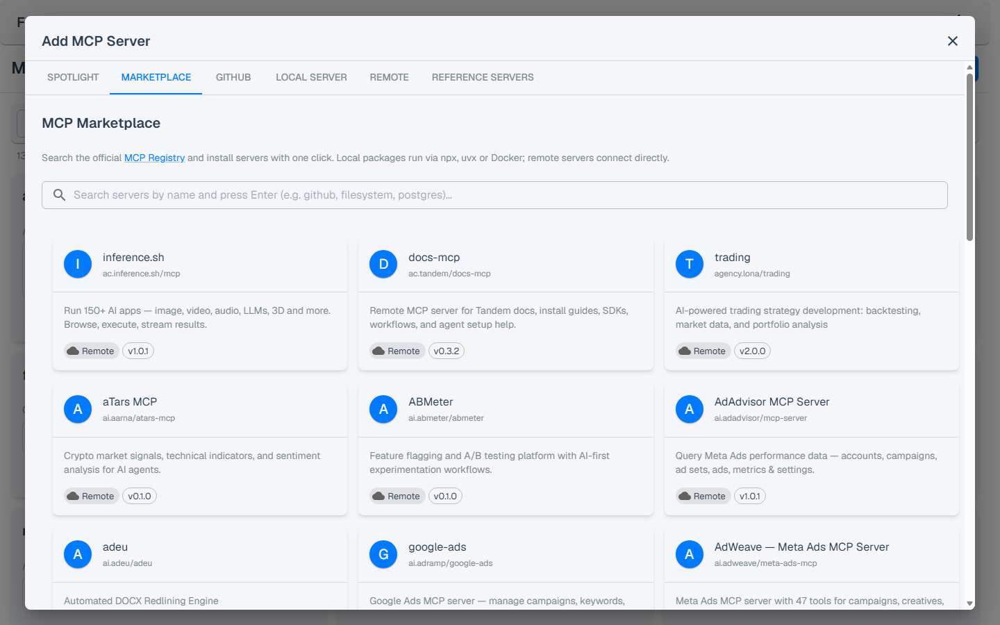

Configuring a server is a guided, three-step form (define it → install & build → define how to run it) with a one-click connection test before you save:

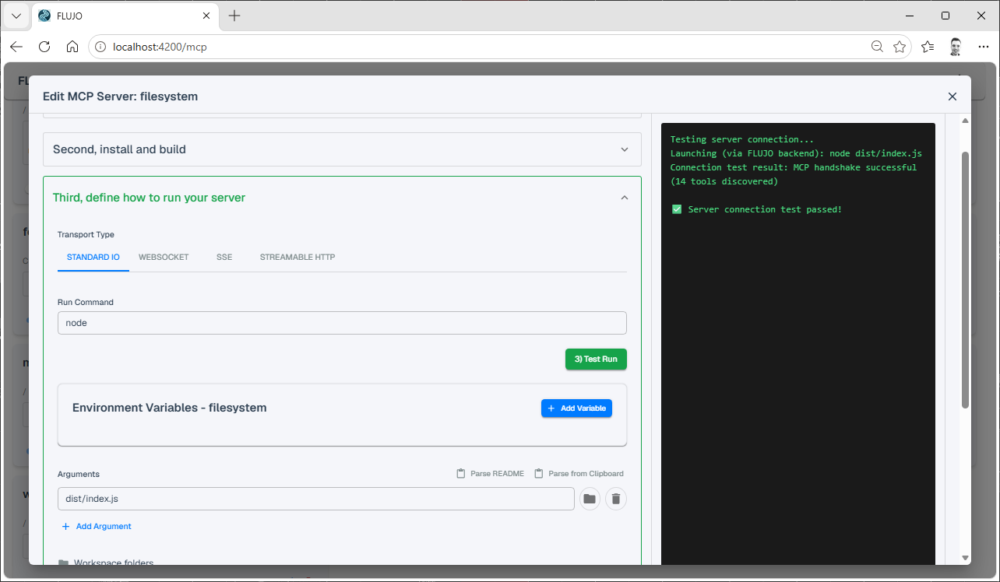

Every connected server gets a detail view to browse and test its tools, resources, and prompts directly:

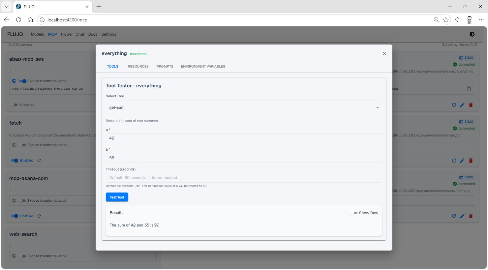

### 🔄 Visual Flow Builder

- **Drag-and-drop orchestration**: connect Start, Process (LLM), MCP, Subflow, and Finish nodes into a graph
- **Branching & handoff**: let a model hand off to another node/agent based on the conversation, build loops, or fan out into multiple specialists
- **Subflows**: call another flow as a single step, with its own isolated state — reuse a flow like a function
- **Per-node tool & prompt scoping**: decide exactly which tools, resources, and system-prompt fragments each node can see

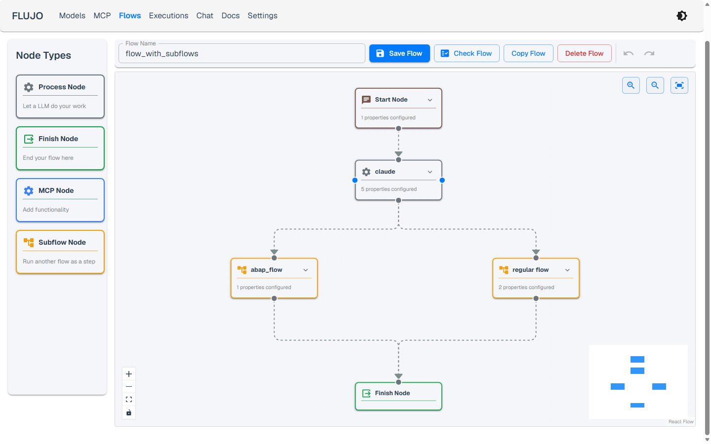
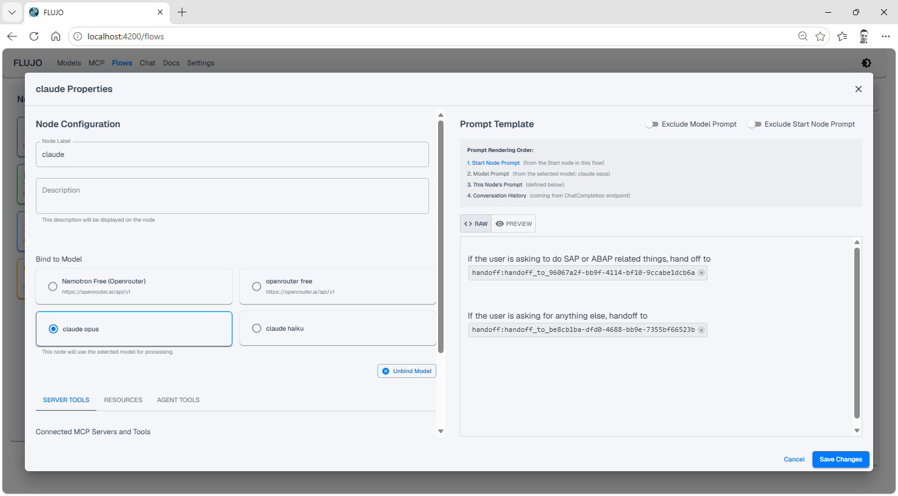

#### Branching & handoff

Connect one node to several successors, then tell the model when to use each handoff tool from the "Agent Tools" tab of its Process Node:


#### Loops

Connect a node back to a previous one the same way to build a loop:


#### Orchestration & Subflows

Combine multiple handoffs and loops to build an orchestrator, or drop in a **Subflow** node to run another flow as a single, reusable step with its own isolated state:


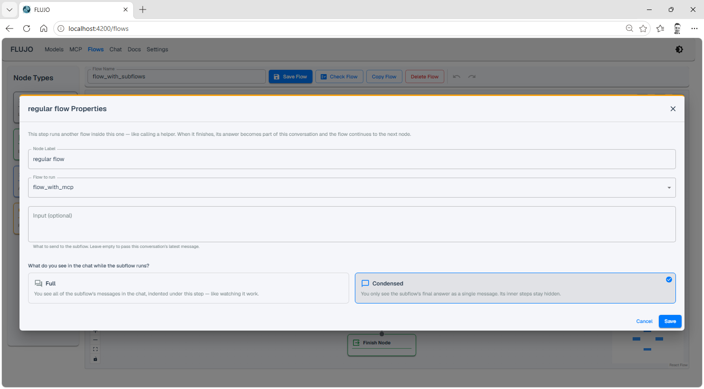

### 💬 Chat Interface

- **Live execution view**: watch a run progress node-by-node in real time, with token usage and a context-window meter per conversation
- **Visual debugger**: set breakpoints, step through a run node-by-node, and inspect state before/after each step
- **Human-in-the-loop tool approval**: optionally require approval before any tool call executes, for any provider (including Claude Subscription's agentic tool use)
- **File & audio attachments**, message editing, and conversation branching

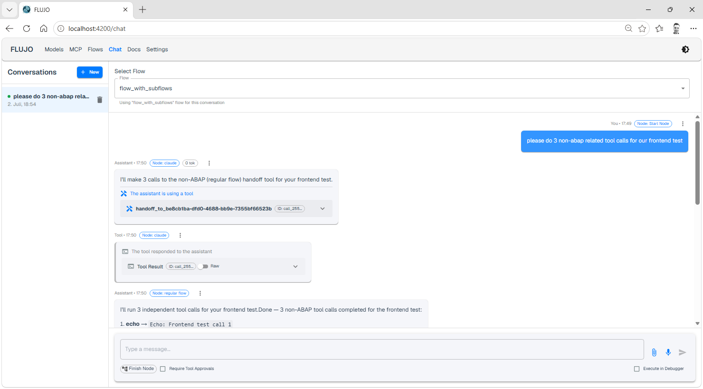

Step through a run node-by-node with the visual debugger, inspecting prep/exec state at every stop:

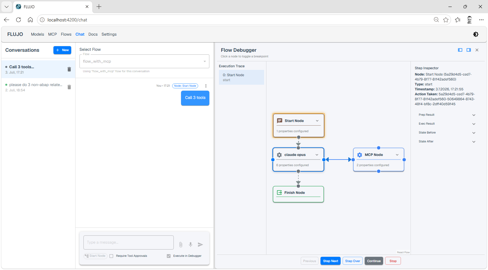

### ⏱️ Planned Executions (Automation)

Run your flows automatically — on a schedule or when something happens — without opening the chat. FLUJO just needs to be running for triggers to fire.

- **Schedule**: cron-style recurring runs (with second-level precision and catch-up for missed runs)
- **Webhook**: trigger a flow via an authenticated HTTP call
- **File watch**: fire when files change under a folder
- **MCP tool polling**: periodically call a tool and fire on change, on new items, or let a model/checker-flow decide
- **URL watch**: fire when a fetched page's content changes

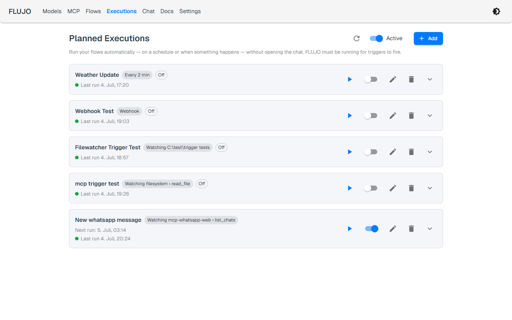
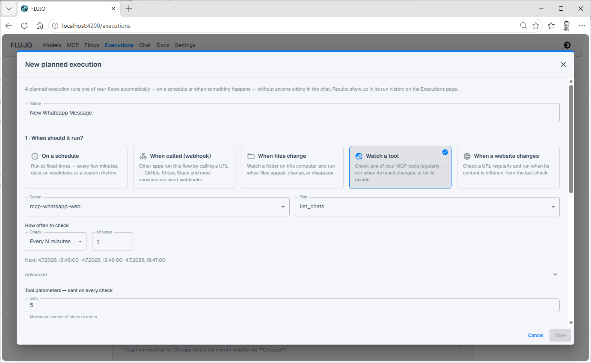

Run history is kept per trigger, with the full output of every run one click away:

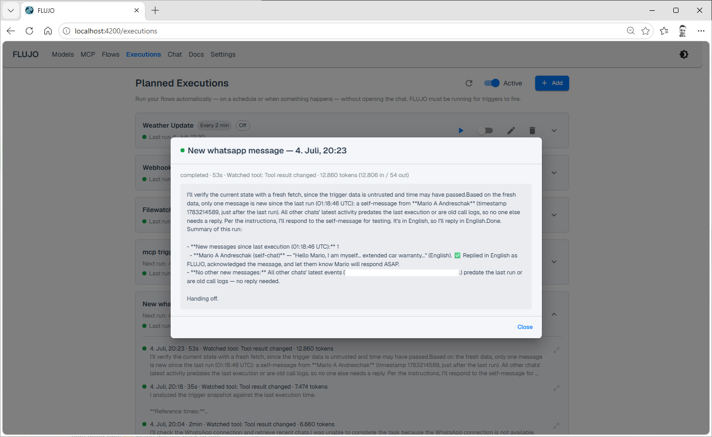

As an example, a "watch a tool" trigger polling a WhatsApp MCP server can turn FLUJO into an autonomous auto-responder:

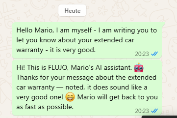

### 🔄 External Tool Integration

- **OpenAI-compatible endpoint**: point Cline, Roo Code, Cursor, or any OpenAI-SDK client at `http://localhost:4200/v1`, use any API key value, and pick a model named `flow-<your-flow-name>`
- **FLUJO as an MCP server (proxy)**: point an external MCP client at `http://localhost:4200/mcp-proxy/<server-name>` to reuse a server you configured once in FLUJO (localhost-only in the current version)

> **Note:** FLUJO does not expose an Ollama-compatible *server* endpoint — use the OpenAI-compatible provider above to consume flows from other apps. (Connecting FLUJO *to* a local Ollama instance as a model provider is a separate, supported feature.)

### 📖 Built-in API Documentation

A searchable `/docs` page inside the app documents every REST endpoint FLUJO exposes (chat, conversations, models, flows, MCP, planned executions, env/encryption, backups) — useful when integrating FLUJO into your own tooling.

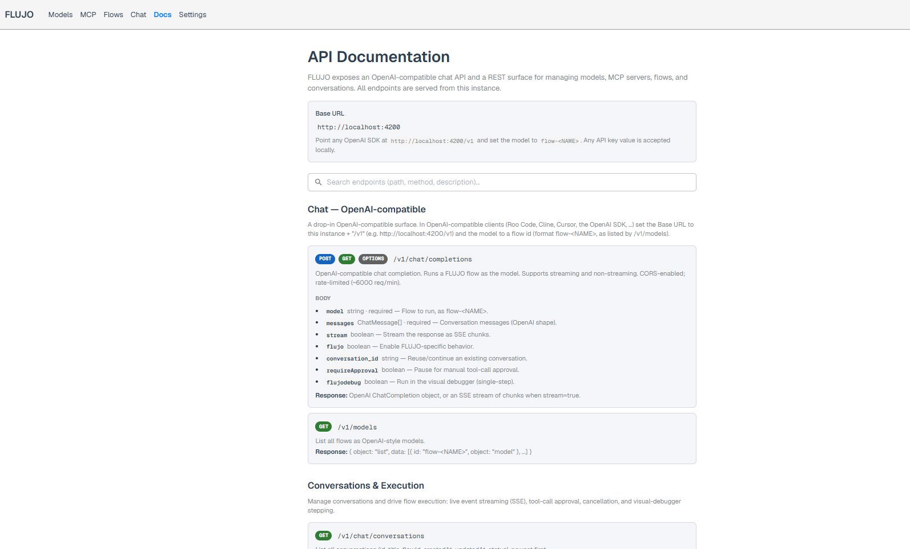

## 🚀 Getting Started

### Manual installation:
### Prerequisites

- Node.js (v18 or higher)
- claude code (optional, if you want to use Anthropic Subscription) 
- python (optional, if you want to use python-based MCP servers)
- pip (optional, if you want to use python-based MCP servers that build with pip)
- uv and/or yarn (optional, if you prefer these over npm or pip)

### Installation

1. Clone the repository:
   ```bash
   git clone https://github.com/mario-andreschak/FLUJO.git
   cd FLUJO
   ```

2. Install dependencies:
   ```bash
   npm install
   # or
   yarn install
   ```

3. Start the development server:
   ```bash
   npm run dev
   # or
   yarn dev
   ```

4. Open your browser and navigate to:
   ```
   http://localhost:4200
   ```
   
5. FLUJO feels and works best if you run it compiled:
   ```bash
   npm run build
   npm start
   ```

### Run with Docker

On any machine with Docker, start FLUJO with one command:

```bash
docker compose up --build
```

Then open http://localhost:4200.

> Use `--build` (not a bare `docker compose up`). The default compose file
> **builds the image locally** from this repo. A plain `docker compose up`
> only builds when no image exists yet — after you update the code it silently
> reuses the previously built image and runs the *old* version. `--build`
> rebuilds when the source changed and is a fast no-op when it hasn't.

- **Your data persists** in the named volumes `flujo-db` (flows, encrypted keys,
  MCP configs, chat history) and `flujo-mcp-servers` (installed MCP server clones),
  so it survives `docker compose down` / `up`.
- **Updating**: use `git pull && docker compose up --build` instead of the
  in-app updater. FLUJO detects it is running in a container and shows this in
  the update settings. (`docker compose pull` only helps if you switched the
  service to a published `image:` — the default builds locally.)
- **Private/corporate CA** for HTTPS MCP servers: mount your CA file and set
  `FLUJO_EXTRA_CA_CERTS` to its path (see the commented `environment:` block in
  `docker-compose.yml`).
- **Claude Subscription** in-container: generate a token on your host with
  `claude setup-token` and pass it as `CLAUDE_CODE_OAUTH_TOKEN`.
- **fileWatch triggers**: bind-mount the host folder you want to watch into the
  container (see the commented volume example in `docker-compose.yml`).

> ⚠️ **Security:** FLUJO has no authentication layer and its git API runs
> commands on the server, so the port is bound to **localhost only** by default.
> Do **not** expose it on `0.0.0.0` / publish it publicly unless it sits behind
> your own authenticating reverse proxy on a trusted network.

### Run via npx (npm package)

```bash
npx flujo-ai
```

This runs a prebuilt FLUJO with no git clone or local build. Your data lives in
`~/.flujo` by default (override with `FLUJO_DATA_DIR`); the port defaults to 4200
(`--port` / `FLUJO_PORT`), and the browser opens automatically unless you pass
`--no-open`. MCP servers may still need `git`, `python`/`uv`, or Node on your
`PATH`. To update, just rerun with `npx flujo-ai@latest`. (The npm package is
`flujo-ai` — the name `flujo` is blocked by npm's similarity rules — but the
installed command is still `flujo`.)

### One-line install (Windows)

On a fresh Windows machine you can install everything (Git, Node.js, Python, uv),
clone FLUJO, build it, and optionally start it with a single PowerShell command:

```powershell
irm https://raw.githubusercontent.com/mario-andreschak/FLUJO/main/scripts/install.ps1 | iex
```

By default FLUJO is installed into `%LOCALAPPDATA%\FLUJO`. To customise the install
without the interactive prompt, set environment variables first, e.g.:

```powershell
$env:FLUJO_DIR = "D:\Apps\FLUJO"; $env:FLUJO_START = "1"; irm https://raw.githubusercontent.com/mario-andreschak/FLUJO/main/scripts/install.ps1 | iex
```

See [`scripts/install.ps1`](scripts/install.ps1) for all options.

### One-line install (Linux / macOS)

The same for Linux and macOS — installs the prerequisites (Git, Node.js, Python,
uv) via your package manager (or Homebrew on macOS), clones FLUJO, builds it, and
registers the `flujo` command:

```bash
curl -fsSL https://raw.githubusercontent.com/mario-andreschak/FLUJO/main/scripts/install.sh | bash
```

By default FLUJO is installed into `~/FLUJO`. To customise without the
interactive prompts, set environment variables first, e.g.:

```bash
curl -fsSL https://raw.githubusercontent.com/mario-andreschak/FLUJO/main/scripts/install.sh | FLUJO_DIR="$HOME/apps/FLUJO" FLUJO_START=1 bash
```

See [`scripts/install.sh`](scripts/install.sh) for all options.

### Uninstalling (Windows)

To remove FLUJO, run the uninstaller:

```powershell
irm https://raw.githubusercontent.com/mario-andreschak/FLUJO/main/scripts/uninstall.ps1 | iex
```

or, from inside your install folder:

```powershell
powershell -ExecutionPolicy Bypass -File scripts\uninstall.ps1
```

It asks, per prerequisite (Git, Node.js, Python, uv), whether to remove it — defaulting
to **yes** for ones FLUJO installed and **no** for ones that were already on your system
— then removes the `flujo` command and the FLUJO folder.

> ⚠️ **This permanently deletes your data.** All flows, encrypted API keys, MCP server
> configs and chat history live in `<install>\db\` and are removed with the folder. Use
> FLUJO's built-in backup/export first if you want to keep them.

Installs created before this feature have no manifest; the uninstaller then defaults every
prerequisite to **keep** (it can't tell which FLUJO installed). Re-running the installer
once writes the manifest for future uninstalls. See
[`scripts/uninstall.ps1`](scripts/uninstall.ps1) for details.

## 📖 Usage

### Setting up often used API keys

1. Navigate to Settings
2. Save your API Keys globally to secure them


### Setting Up Models

1. Navigate to the Models page
2. Click "Add Model" to create a new model configuration
3. Configure your model with name, provider, API key, and system prompt
4. Save your configuration

### Managing MCP Servers

1. Go to the MCP page
2. Click "Add Server"
3. Pick a tab: **Spotlight** (curated, one click), **Marketplace** (search the official MCP Registry), **GitHub** (install from a repo), **Local Server**, **Remote**, or **Reference Servers**
4. Configure server settings and environment variables
5. Start and manage your server, or open its card to browse/test its tools, resources, and prompts

### Creating Workflows

1. Visit the Flows page
2. Click "Create Flow" to start a new workflow
3. Add processing nodes and connect them
4. Configure each node with models and tools
5. Save your flow

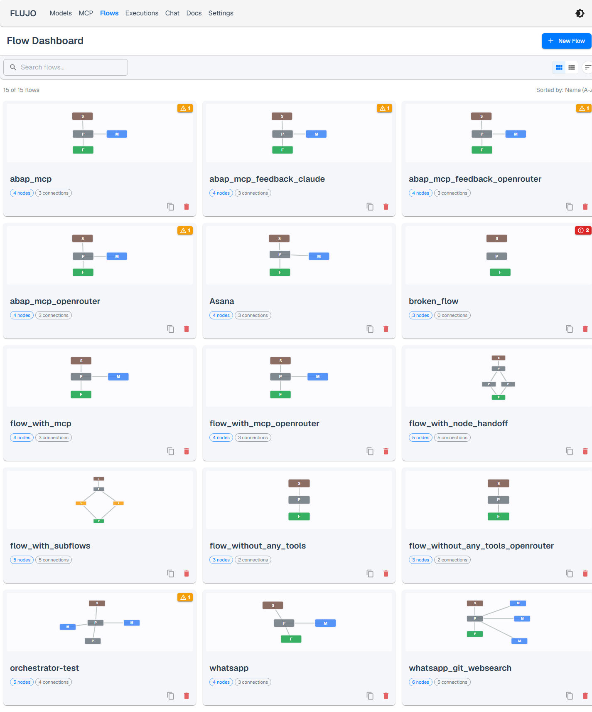

For branching, loops, and subflows, see [Orchestration & Subflows](#orchestration--subflows) above.

### Automating Flows (Planned Executions)

1. Go to the Executions page
2. Click "Add" and choose a trigger: Schedule, Webhook, File Watch, MCP Tool Polling, or URL Watch
3. Pick the flow to run and configure the trigger-specific options
4. Save — FLUJO fires the trigger and runs the flow in the background while it's running, and shows the run history on the same page

### Using the Chat Interface

1. Go to the Chat page
2. Select a flow to interact with
3. Start chatting with your configured workflow — enable "Execute in Debugger" or "Require Tool Approvals" from the input bar if you want more control over the run

## 📄 License

FLUJO is licensed under the [MIT License](LICENSE).

## 🚀 Roadmap

Most of the original roadmap has shipped: MCP resources/prompts/roots/sampling, the MCP Marketplace & Spotlight, subflows, the visual debugger, and Planned Executions (scheduled/triggered headless runs) are all in. The main thing left on the list is **AI-assisted flow generation** — describe what you want and have FLUJO draft the flow for you.

Beyond that, ideas we're keeping an eye on:
- Real-time voice input/output
- Deeper MCP roots support (checkpoints/restore)
- Edge-device-friendly builds

Have a feature request? Open a GitHub issue or drop it on Discord — see [above](#a-few-words-in-advance).

## 🤝 Contributing

Contributions are welcome! Feel free to open issues or submit pull requests.

1. Fork the repository
2. Create your feature branch (`git checkout -b feature/amazing-feature`)
3. Commit your changes (`git commit -m 'Add some amazing feature'`)
4. Push to the branch (`git push origin feature/amazing-feature`)
5. Open a Pull Request

## 📬 Contact

- GitHub: [mario-andreschak](https://github.com/mario-andreschak)
- LinkedIn: https://www.linkedin.com/in/mario-andreschak-674033299/

## Notes:
- You can add ~FLUJO=HTML, ~FLUJO=MARKDOWN, ~FLUJO=JSON, ~FLUJO=TEXT in your message to format the response, this will give varying results in different tools where you integrate FLUJO.
- You can add ~FLUJOEXPAND=1 or ~FLUJODEBUG=1 somewhere in your message to show more details
- in config/features.ts you can change the Logging-level for the whole application
---

FLUJO - Empowering your AI workflows with open-source orchestration.

## Ecosystem
[](https://mseep.ai/app/mario-andreschak-flujo)
[](https://mseep.ai/app/3f62578d-605f-474c-9472-c5e40df60ee0)
