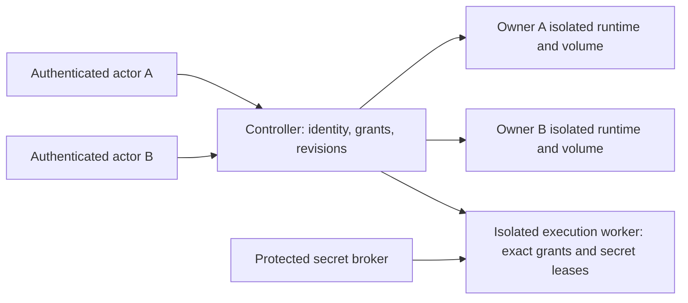

# Identity, storage and sharing contracts v1

Status: design proposal for #573, with a runnable source prototype. Security and
maintainer review, #564 agreement, migration/artifact qualification and independent
acceptance remain pending. #574/#575 must not enable shared/public deployment on
this proposal alone. #212 remains the product roadmap.

Source baseline: Security PR #582 at
`2c02fd0d3e4c36e702537a2e67bdd3d240101533`, based on
`3511ba49514fe8cf525f5a22c16c3806bf3886ba`. The prototype imports that version's
actual `ownerCredentials.ts` verifier/issuance functions. It does not copy or
change Security's authentication, encryption or MCP enforcement primitives.
Newer principal/recheck and credential migration contracts must be integrated
under their own exact reviewed pins before implementation acceptance.

## Proposed topology and alternatives

Choose one controller and a dedicated OS-isolated runtime/data root per owner.
The controller handles identity, current grants, metadata and admission. It never
loads FLUJO execution/MCP modules or any owner's keyring. Each runtime serves only
its assigned owner namespace over a private authenticated channel. Team execution
uses separately admitted isolated workers with explicit resource/credential-use
leases; humans never receive a runtime's broad administrative bearer.



Existing process-wide caches, DEKs and process registries make cohosting mutually
untrusted owners in one FLUJO process a large refactor with many hidden escape
paths. Separate runtime ownership permits incremental compatibility while #568
qualifies OS/container mounts, environment, egress and resource enforcement.
Separate Node processes under one unrestricted OS account are insufficient.

| Alternative | Decision and consequence |
| --- | --- |
| Workspace IDs as tenancy in one process | Reject: selectors and logical directories do not establish authenticated ownership; DEK/global/process state remains shared. |
| Full tenant partition of every execution module immediately | Defer: requires pervasive context/cache/keyring/process changes before safe deployment. Keep inventoried as a future option. |
| Dedicated owner runtime with controller and isolated execution workers | Proposed choice: preserve file-backed owner runtime compatibility; add explicit controller authorization and qualify physical isolation. More runtime overhead must be budgeted. |
| Existing JSON files as the shared control ledger | Reject for grants + revision + audit transitions: independent file publication is not a single transactional commit. |
| One transactional controller database | Proposed choice: SQLite on one controller/one local disk; transactions for metadata, grants, revisions, admissions and audit. Multi-controller/network-filesystem SQLite is unsupported. A later horizontal profile needs its own database design and acceptance. |

## Identity and authority

For hosted humans, choose a configured OpenID Connect provider and authorization
code login with PKCE. Verify issuer, signature, audience, nonce/state and token
lifetime; resolve `(issuer, subject)` to an operator-owned immutable actor ID.
Email, parsed claims, proxy headers and selected workspace never create grants.
Provider validation follows the [OpenID Connect validation contract](https://openid.net/specs/openid-connect-core-1_0.html#IDTokenValidation).
This provider/session implementation is not present in the prototype.

Browser sessions use server-issued opaque IDs, HttpOnly/Secure/SameSite cookies,
exact allowed Origin/CSRF checks for mutations, rotation after authentication,
expiry and durable revocation. No admin bearer in browser storage or EventSource
URLs. These proposed controls follow [OWASP session management guidance](https://cheatsheetseries.owasp.org/cheatsheets/Session_Management_Cheat_Sheet.html).
Security owns the concrete session/token implementation and migration.

Native API/MCP clients consume Security's opaque scoped credentials. A dedicated
worker bearer, human session, owner API credential and execution-adapter authority
remain distinct. Current coarse owner scopes do not become team permission roles.
Source prototype tokens are disposable and are never recorded in its report.

The controller's immutable context must carry:

```text
actorId, actorKind (human/service), tenantId, membershipRevision,
credentialId/sessionId, authRevision, resourceId, resourceGeneration,
action, grantRevision, requestId, issuedAt, expiresAt, executionId (if admitted)
```

The server resolves these values from authenticated policy and resource records.
Client selectors only narrow already authorized resources. Runtime transfer uses
an audience-bound authenticated internal envelope verified by the receiving
runtime, never a trusted `x-user`/`x-tenant` header. Keep initiating human/service
actor distinct from the runtime's service credential and resource owner.

Use immutable async context for HTTP, SSE/MCP subscriptions, timers and subflows.
Persist only authority references/revisions for durable jobs; after restart,
resolve current grants, credentials, membership, owner generation and budgets
before any privileged boundary. A captured context/signature is not a reusable
permit after revocation. Recheck after awaited IO and immediately before external
effects; ongoing streams stop on loss of access. Following
[OWASP authorization guidance](https://cheatsheetseries.owasp.org/cheatsheets/Authorization_Cheat_Sheet.html),
unknown routes/resources/actions deny by default and services also enforce checks.

## Resource ownership and authorization matrix

Every record has immutable `resourceId`, `ownerType` (user/team), `ownerId`,
`tenantId`, `generation`, `schemaVersion`, `revision`, creator and creation time.
Resource paths are derived from server-owned registry entries after authorization;
no client path/ID/header can select a different owner's root. IDs are not secrets.
Cross-owner missing/forbidden reads use the same non-disclosing response.

| Resource or route family | Tier 0 | Tier 1 explicit permission | Separate gate |
| --- | --- | --- | --- |
| Workspace list/select/metadata | Current actor's owned resources only | Team membership + workspace view | Existing workspace selector is not authorization. |
| Models/provider metadata | Owner read/edit | Model view/edit; metadata excludes secrets | Execute requires distinct model credential-use delegation. |
| MCP servers/tools/resources/prompts/Apps | Owner read/edit/run as granted | Capability view/edit/use, exact package/tool identity | #568 host/container/files/env/egress grants; resources can contain private data. |
| Flows/packages and their dependencies | Owner read/edit/run | Flow view/edit/run | Sharing a flow grants none of its model/MCP/file/secret dependencies. |
| Chats/logs/traces/waves/statistics | Owner read/export | Explicit view/export of specified resources | Redact secret/tool payloads according to resource policy. No workspace-wide implied view. |
| Executions, tasks, schedules, goals, subflows | Owner run/observe/stop | Explicit run/observe/stop | Current authority at admission/resume/each effect; child inherits a narrower context, never broader grants. |
| Approvals/elicitation/question registries | Owned run + approve | Explicit approve on exact run/resource | Bind to run generation, original actor and current grant; pending ACK is not effect or exit proof. |
| HTTP/SSE/MCP subscriptions and reconnects | Authenticate + current resource subscribe | Explicit subscribe/view | Recheck established streams and per-tool dispatch; transport session ID grants no access. |
| Files/git/shell/install/capture/native APIs | Owner exact resource/action | No broad team host access in this tier | OS adapter and #568 capabilities; no arbitrary host root or shared OS-account fallback. |
| Export/package/snapshot transfer | Owner export | Explicit export of authorized resources | Ordinary export omits credentials, control policy, sessions and private provenance. Deliberate secret transfer needs recipient keying and consent. |
| Backup/restore/migrations | Operator/admin + exact owner namespace | Team admin only for team records | Consistent metadata + ciphertext + protected key recovery; no resurrection of stale grants/sessions. |
| Administrative controls/auth/key recovery | Installation operator | No team member privilege escalation | Out-of-band recovery, audit, revocation and explicit passphrase/key protection. |
| OAuth/webhook/worker/adapter callbacks | Their independently authenticated protocol | No blanket exemption | Exact method/path, replay/current identity checks; sibling endpoints default deny. |

The [source inventory](shared-runtime-inventory.json) enumerates all 201 `route.ts`
paths at the baseline for method-level classification. It is a lexical inventory,
not evidence that these routes enforce the proposed matrix. #574 must cover
list/read/write/delete/run/approve/subscribe/export for both principals, including
guessed valid IDs and conflicting workspace selectors. Unclassified methods deny.

## Secrets and explicit sharing

Tier 0 private ownership is default. Tier 1 has owner/admin, member and nonmember
membership states, with explicit resource actions `view`, `edit`, `run`, `approve`,
`subscribe`, `export`, `stop`, `admin` and distinct `credential-use`. Membership
alone grants none of them. Owner/admin can grant/revoke within its own namespace;
members cannot self-elevate or share a dependency they do not administer.

Keep model/OAuth/environment secrets in Security's protected per-owner/team
key authority. Raw secret retrieval is an operator capability, never a side
effect of sharing model metadata or editing/running a flow. The secret broker
issues short-lived use leases tied to actor, resource/grant revisions, exact
provider/account, tool/source identity, action and execution. No owner credential
silently follows a shared flow. Transfer/ownership change creates a new reviewed
resource generation and recipient key wrapping; it does not relabel old requests.

A sharing transaction publishes the resource grant, dependency-use grants,
revision and redacted audit event atomically. Concurrent editors present a base
revision; one serialized update succeeds and a stale editor receives a visible
409 conflict. Conflict resolution is a deliberate new edit, never hidden last
write wins. Edit locks, if added, have bounded expiry and do not replace revision
checks. Audit identifies actor/action/resource/generation/from-to revisions,
request/execution IDs and result class, without credentials or conversation text.

Revocation increments durable revisions, fences subsequent actions/callbacks/
schedule admissions and closes subscriptions. Already-entered work has an explicit
owned stop/observation policy: stop intent is not OS process exit or remote cleanup.
Retain uncertain admissions and outcome evidence; do not replay or refund effects.
#575 stays gated on #574 and requires an owner/member/nonmember matrix plus two
independent users completing the candidate-artifact share/edit/run/revoke journey.

## State, budgets and migration

The lexical state inventory records 400 occurrences in 105 backend/utility files
at the baseline. It is deliberately marked incomplete pending semantic review.
Each record identifies its exact file/line and requires a dedicated-owner runtime
boundary; no runtime module may be imported into the shared controller.

| Actual state seam | Specific isolation plan |
| --- | --- |
| `utils/workspace.ts`, `utils/paths.ts`, storage backend | One fixed owner data root per OS-isolated runtime; immutable ALS workspace selection only inside that owner. Server registry checks before path selection. |
| `utils/encryption/session.ts`, `secure.ts` | Owner runtime DEK/session only; controller never receives keys. Team/use leases use protected broker authority, not global/default encryption. |
| Model cache/clients, Claude/Codex session stores | Owner runtime/provider/account binding; no shared credential/session cache. Jobs carry exact admitted provider/account references. |
| MCP lifecycle/connection/lease/OAuth/task registries | Runtime + owner + server generation keys; OS-isolated mounts/env/egress/children. Remote scopes are externally enforced and separately reviewed. |
| Flow execution caches/locks/event bus/log/summary/cancellation | Owner runtime boundary, immutable run/actor lineage, exact owned cancellation. No cross-runtime active-run sweep or global cancellation broker. |
| Scheduler singleton/event bus/approval queues | Owner runtime only; current grant checks on automatic admissions/resume. Signed worker-local provenance remains outside exported workspace. |
| Persona dispatch/activity/goal/recovery/memory registries | Dedicated owner runtime and durable actor/grant/generation references; copied state cannot confer execution authority. |
| Question/elicitation/meeting/wave/statistics registries | Runtime owner + exact resource scope for reads/events, callbacks bound to immutable initiating context. |
| `backend/init.ts`, worker bootstrap, snapshot/restore/mutation gates | One configured owner per runtime; current authority fences before startup effects, migrations and restored execution. Never auto-start all owners in a shared process. |
| MCP App broker/sandbox, host adapters, Spotlight/KV/package installers | Dedicated runtime, explicit OS/capability grants and budgets; no controller host services exposed as implicit team tools. |
| Remaining inventoried or newly discovered state | Cannot load in controller; assign semantic owner and test the physical boundary before enabling the corresponding route. Lexical absence is not proof. |

Admission budgets are per initiating actor and owner/team namespace: concurrent
runs/processes, queued work, bytes/storage, stream count, CPU/memory, execution
duration and admitted provider spend. Runtime enforcement and #568 resource caps
must exist before admission; metadata limits alone cannot bound hostile tools.
Budget/OFF/admission ledger authority remains with its original issuer. Preserve
O/FACTORY original request UUIDs, digests, account/role/domain/model, owner/OFF
epochs, leases and original/current binding separately. Local actor/session
authentication never supplies their account, billing or capture authority.

Migrate single-owner installations in place only after a read-only ownership and
secret inventory, consistent backup, verified recovery and explicit owner mapping.
Keep file-backed runtime layout and immutable resource/run identities. Stage the
controller's metadata schema and ownership mapping transactionally; freeze writes
with a real enforced gate before taking a coherent cutover snapshot. Stopping a
listener or receiving cancellation ACKs is insufficient. Validate all recoverable
encrypted records under #567 before committing the migration marker.

Rollback returns to the retained compatible runtime/data revision with original
keys and identities. Do not reopen anonymous network access, revive revoked
sessions/grants, restore a spent allowance or replay uncertain runs. Backup restore
revalidates current identity/key/grant/epoch authority; restoring historical records
does not restore an execution permit. Operator recovery is out of band, audited
and must not allow a team admin to recover another owner's raw credentials.

## Runnable prototype and remaining gates

From an owned checkout with Node 22+, dev dependencies and the pinned Security
source, run:

```text
node scripts/ownership-prototype/run.cjs
node scripts/ownership-prototype/run.cjs C:/absolute/path/prototype-report.json
```

The program creates a disposable directory, issues two synthetic owner credentials
using Security's real primitive, starts two loopback fixture processes with separate
data/policy roots, and cleans up only those exact children and its verified temporary
directory. It makes no provider/cloud/account calls and records no raw tokens.
Its report retains the source revision/verifier hash and these checks:

1. Each runtime lists only its registered owner resources.
2. A foreign valid bearer is refused by the other runtime.
3. Guessed foreign resource IDs cannot read/write/start background work/subscribe.
4. Forged identity and conflicting workspace claims cannot change authority.
5. A credential without control scopes is denied.
6. Missing bearer and corrupt/mismatched private policy fail closed, while the
   other owner remains usable.
7. Concurrent edits with one revision produce one success and one visible conflict.
8. Concurrent callbacks retain the initiating actor/tenant/workspace.
9. Revocation fences already accepted callback work and closes the existing stream;
   client cancellation cannot satisfy the stream's server-closure assertion.

These are synthetic fixture HTTP routes and file writes, not installed FLUJO
routes, browser sessions, durable worker jobs, secret delegation or hostile-code
isolation. The prototype retains a bearer in its fixture Request for revalidation;
production streams must consume Security's no-bearer recheck witness. No source
fixture establishes independent user/operator acceptance or an accepted design.

Before #573 acceptance: review topology/controller database, identity/session/
principal/key contracts, threat and complete route/state inventory, migration/
rollback, budget enforcement and explicit unsupported profiles. Before #574:
implement the full two-user matrix and OS/runtime/secret boundaries on exact
candidate Windows/Linux artifacts, including restart and backup/restore. Before
#575: implement explicit sharing/dependency leases/revocation, conflict/audit
coverage and the independent two-user journey. #570 requires the integrated
non-author operations drills and reproducible recovery evidence.

Current supported deployment remains the documented trusted-owner local profile
and specifically qualified worker profiles. Hosted/shared/public profiles are
unsupported until their whole acceptance chain passes; a login screen, this
prototype and a draft design do not enable them.
