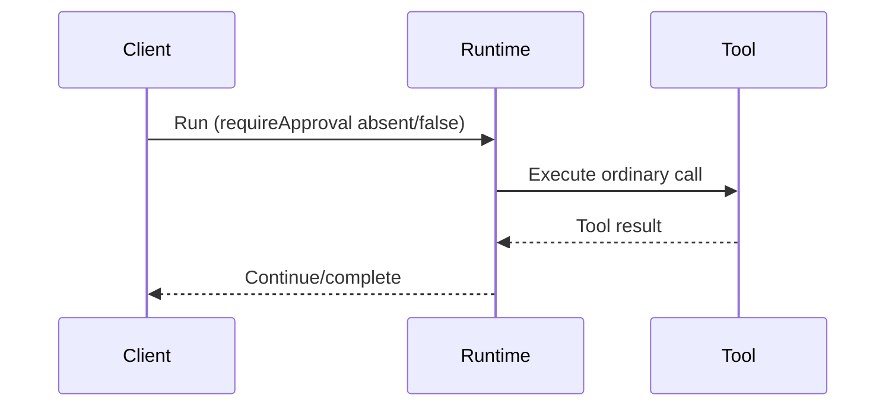
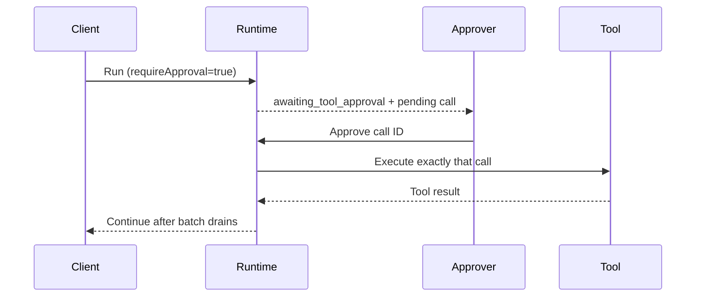
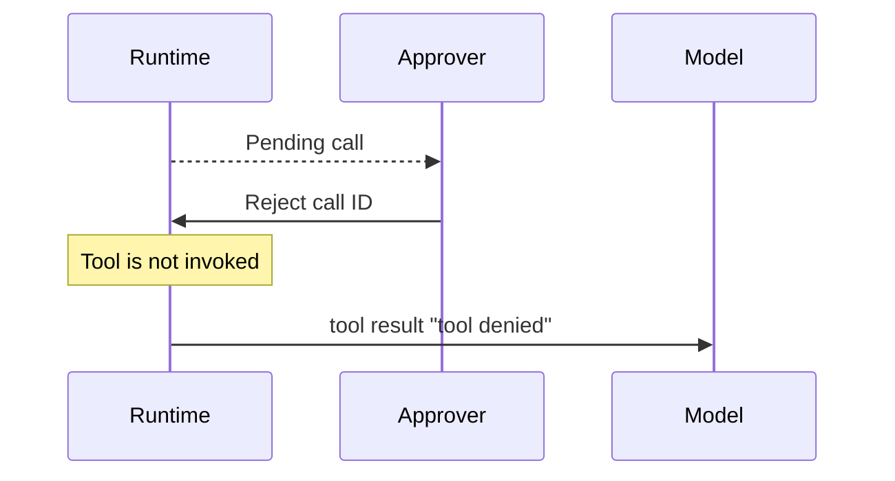
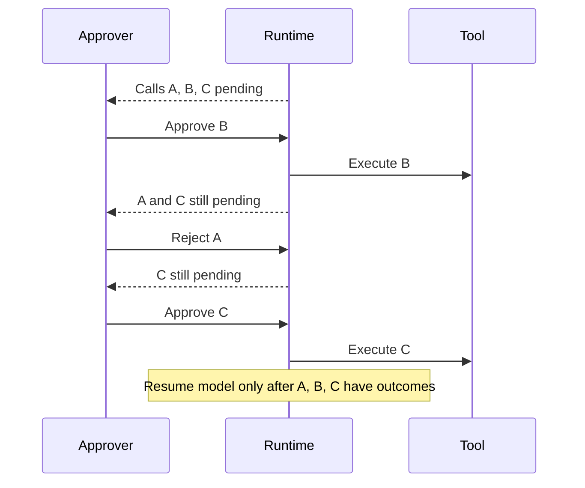

# Single-gate tool approval proposal

Status: Proposed; stakeholder sign-off required  
Design issue: [#469](https://github.com/mario-andreschak/FLUJO/issues/469)  
Removal history: [#438](https://github.com/mario-andreschak/FLUJO/issues/438)  
Reviewed code baseline: `668516f2cbd176b422c8185d4058227e6b0e1781` on `main`  
Plan baseline: `b9379f7522232c52a26cae119bdb164d6dbe15aa` (verified ancestor of the reviewed baseline)

## Purpose and scope

This proposal defines one predictable approval model for ordinary tool calls. It is a
design and requirements artifact only. Issue #469 must not change production
behavior. Runtime changes and tests belong in a separate implementation issue
created only after the sign-offs in this document are complete.

The design preserves the conversation-level **Require Tool Approval** checkbox as
the only user approval gate. It distinguishes that choice from runtime bookkeeping,
capability composition, and the operational outcome selected by a headless caller
that has no approver.

## Minimal user model

1. The checkbox is stored per conversation.
2. Off, or missing for an older conversation, means ordinary tool calls execute
   without an approval pause.
3. On means every applicable ordinary tool call pauses before execution. The user
   approves or rejects each call independently.
4. Approval is not remembered for a tool, server, resource, folder, path, or later
   call.
5. A rejected call is never invoked. The model receives exactly `tool denied`.
6. Pending calls already shown to a user stay pending until explicitly decided or
   the run is cancelled. Changing the checkbox never silently executes them.
7. Internal registries and Persona/Enduring-Agent capability snapshots are not
   additional approval gates.

"Applicable ordinary tool call" excludes internal handoff control calls. Handoff
ordering is an execution concern and must not create approval cards or bypass the
gate for ordinary calls in the same assistant batch.

## Current-state inventory

The source-level walkthrough was repeated at the reviewed baseline. No tests were
run as part of this design phase.

| Concern | Current location | Classification | Finding |
| --- | --- | --- | --- |
| Checkbox and local state | `src/frontend/components/Chat/ChatInput.tsx`, `src/frontend/components/Chat/index.tsx` | User gate | Conversation-scoped UI, hydrated with a false fallback |
| Persistence client | `src/frontend/services/chat/index.ts` | User gate | PATCHes `requireApproval` |
| Conversation GET/PATCH | `src/app/v1/chat/conversations/[conversationId]/route.ts` | User gate | Missing reads as false; writes require a boolean |
| Runtime normalization and dispatch | `src/backend/execution/flow/runFlow.ts` | User gate | `input.requireApproval ?? false`; pauses or directly executes ordinary calls |
| Pending call state | `pendingToolCalls`, `awaiting_tool_approval` | Runtime approval state | Describes undecided calls; does not decide permission |
| Approval registry | `src/backend/execution/flow/toolApprovalRegistry.ts` | Runtime coordination | Locates pending work; not an allow/deny policy |
| Decision application | `src/backend/execution/flow/resumeAfterApproval.ts` | Runtime approval state | Decides one call, emits `tool denied` on rejection, resumes after drain |
| Chat respond resume | `src/app/v1/chat/conversations/[conversationId]/respond/route.ts` | Boundary | Two false-default violations currently use `?? true` |
| Approval API resume | `src/app/api/approvals/[id]/route.ts` | Boundary | Two false-default violations currently use `?? true` |
| Scheduler policy mapping | `src/backend/services/scheduler/index.ts` | Headless transport behavior | Maps an explicit scheduler setting into gate and no-approver outcome |
| Persona dispatcher | `src/backend/services/enduringAgents/personaDispatcher.ts` | Headless transport behavior | Carries explicit approval options into headless execution |
| `Flow.behaviorRules` / `SharedState.behaviorRules` | `src/backend/execution/flow/nodes/ProcessNode.ts` | Capability snapshot | Filters Persona-native capabilities; must never approve, deny, or bypass ordinary calls |
| Removed allow/deny/ask and protected-path mechanisms | #438, commit `9c99e755` | Obsolete policy | Must not be reintroduced |

Existing regression intent is captured by:

- `__tests__/flow/toolApprovalSingleGate.test.ts`
- `__tests__/flow/requireApprovalDefault.test.ts`
- `__tests__/chat/applyApprovalDecision.test.ts`
- `__tests__/chat/headlessApproval.test.ts`
- `__tests__/scheduler/approvalPolicy.test.ts`
- `__tests__/scheduler/approvalsRoute.test.ts`

Intervening flow work stages mixed handoff/tool batches, excludes handoff calls from
ordinary approval, preserves unanswered-call detection, and applies a repeat guard
on resume. The implementation must preserve those behaviors.

## Proposed decisions

These decisions are normative once every required reviewer signs this document.

| Topic | Proposed decision | Rationale |
| --- | --- | --- |
| Default | Missing `requireApproval` is false at every boundary, including all resume routes | Older records remain compatible and the checkbox remains opt-in |
| No approver | Keep explicit `fail` and `pause` operational outcomes; default `auto` selects the entry point's documented behavior | This determines how an enabled gate is surfaced, not whether a call is authorized |
| Mid-flight toggle | A run snapshots the value when it accepts a model-produced ordinary-call batch. Changes affect only later batches | Prevents a UI race from changing the meaning of already-rendered decisions |
| Already-pending calls | They require decisions under the snapshot that created them, or explicit cancellation | Disabling the checkbox cannot silently execute visible pending calls |
| Batch semantics | Decide calls individually and resume model execution only after the ordinary-call batch drains | Gives every call an explicit outcome while maintaining assistant-batch integrity |
| Mixed handoff/tool batches | Handoff calls are not approval subjects; staged ordering and unanswered-call handling remain intact | Approval must not expose internal control calls or reorder execution |
| Rejection | Fixed model-visible `tool denied`; no free-text reason | Deterministic and minimizes sensitive disclosure |
| Persistence failure | Do not present an unpersisted final checkbox state; restore the persisted state and show an actionable error | UI and server state must converge |
| Snapshot boundary | Preserve `behaviorRules` as backend-only capability snapshot data; accept legacy `permissionRules` only while reading old records | This vocabulary remains separate from the approval gate |
| Alternate providers | All providers enter shared approval handling with identical semantics | Provider choice must not weaken or strengthen the gate |
| Arguments | Show enough context for a decision, but do not add argument copies to telemetry, issue comments, or model rejection output | Supports informed decisions without widening data exposure |

## State contract

| State | Meaning | Permitted exits |
| --- | --- | --- |
| `running` | Model or non-gated execution is in progress | awaiting approval, completed, cancelled, errored |
| `awaiting_tool_approval` | At least one applicable call is pending and no pending call may execute without its decision | awaiting approval, running, cancelled, errored |
| `resumed` | All calls in the pending batch have outcomes and execution is being continued | running, awaiting approval, completed, cancelled, errored |
| `cancelled` | The run was explicitly stopped; pending decisions are invalid | terminal |
| `errored` | Execution ended unsuccessfully, including explicit fail-fast when no approver is attached | terminal |
| `completed` | Execution ended successfully | terminal |

`resumed` is a logical transition and need not become a newly persisted public
status if the implementation can preserve the same observable contract atomically.

### Core sequences

Unchecked or missing:



Checked and approved:



Checked and rejected:



Multiple calls:



### Recovery, cancellation, and failure rules

- A pending decision is bound to conversation, run, assistant batch, and tool-call
  identifiers. The server verifies ownership before applying it.
- The first accepted decision for a call is final. An identical retry returns the
  already-applied outcome or another documented idempotent success response.
  A contradictory retry returns a conflict and never invokes a tool.
- Unknown, stale, cancelled, completed, or mismatched identifiers return a
  non-sensitive not-found or conflict response.
- Restart recovery reloads the persisted pending batch and preserves all recorded
  outcomes. It must not execute undecided calls or re-execute decided calls.
- Cancellation atomically invalidates remaining pending calls.
- A tool failure becomes that approved call's tool outcome and does not convert any
  undecided sibling into an approval.
- The repeat guard, staged handoff state, and unanswered-call detection survive
  restart and partial decisions.

## API and persistence contract

### Conversation setting

```ts
type ConversationApprovalSettings = {
  requireApproval?: boolean; // missing is read as false
};
```

- GET responses expose an effective boolean.
- PATCH accepts only a JSON boolean and rejects other types.
- A successful PATCH is the persistence boundary for later batches.
- Existing conversations need no migration because a missing value means false.
- Every runtime, debug, resume, scheduler, API, and provider adapter normalizes with
  `value ?? false`; truthiness coercion is forbidden.

### Pending calls

A pending-call representation must contain an opaque decision identifier, stable
tool-call identifier, tool identity, decision-safe argument context, conversation
and run association, and current decision state. Raw secrets must not be added
solely for approval display.

Approval endpoints must:

1. authenticate the caller;
2. authorize access to the owning conversation/run;
3. atomically claim the undecided call;
4. validate that the run and batch are still pending;
5. execute only when the explicit decision is approve;
6. record the deterministic outcome;
7. resume only when the ordinary-call batch is drained; and
8. re-register a later batch if the continued model response pauses again.

Clients opt in only through `requireApproval=true`. They observe
`awaiting_tool_approval` and `pendingToolCalls`, submit one decision per call,
and treat fail-fast as a terminal, machine-readable approval-required error rather
than a denial policy.

## No-approver behavior

When the gate is false, `onApprovalRequired` is ignored.

When the gate is true:

- an interactive entry point pauses and publishes pending calls;
- a headless entry point configured to `pause` persists a resumable pending run;
- a headless entry point configured to `fail` executes no tool and returns a
  machine-readable terminal error; and
- `auto` resolves to the documented behavior of the entry point.

These values never auto-approve or reject a call and therefore are transport/runtime
outcomes, not a second authorization source.

## Workflow review record

This table records the source-level engineering walkthrough. Stakeholder acceptance
must be added in the sign-off section; source inspection is not a substitute.

| ID | Actor and initial setting | Expected transitions and visible result | Pain point / security expectation | Proposed acceptance |
| --- | --- | --- | --- | --- |
| W1 | Chat user; on | running → awaiting → resumed | Every ordinary call is visible before execution | Per-call approve/reject |
| W2 | Chat user; off or missing | running → completed/error | No unexpected pause | Default false everywhere |
| W3 | User switches conversations | Each view hydrates its stored value | No setting leakage | Scope strictly per conversation |
| W4 | User; on; multiple calls | Await until all calls have outcomes | Partial decisions must not lose/reorder calls | Individual decisions, batch drain before resume |
| W5 | User rejects | Tool never runs; model sees `tool denied` | No sensitive or free-text feedback | Fixed rejection result |
| W6 | User toggles during run/pause | Current batch keeps snapshot; future batch uses successful persisted value | No silent execution race | Batch-bound semantics |
| W7 | User refreshes/retries/cancels | Persisted pending state recovers or becomes stale/cancelled | No duplicate execution | Atomic idempotent decisions |
| W8 | API client; on | Observe pending status, decide by opaque ID, resume | Ownership and machine-readable errors | Same gate and state contract |
| W9 | Scheduler/headless; on | Explicit pause or fail-fast; execute nothing undecided | No deadlock or hidden decision | Operational no-approver outcome |
| W10 | Alternate-provider user | Same transitions as W1/W2 | Provider cannot bypass gate | Shared contract tests |
| W11 | Persona/Enduring Agent | Capability snapshot selects available tools; gate still handles emitted ordinary calls | Capability composition is not authorization | Snapshot cannot approve/deny/bypass |

## Normative requirements and traceability

| ID | Requirement | Workflows | Future verification |
| --- | --- | --- | --- |
| R1 | `requireApproval` MUST be boolean when supplied and MUST default to false when absent at every boundary | W1–W3, W8–W10 | Route/runtime/provider absent-false-true matrix |
| R2 | The persisted conversation value MUST be the sole user approval-policy source | W1–W3, W11 | Search/static regression plus behavior tests |
| R3 | With the gate on, an ordinary call MUST NOT execute before explicit approval | W1, W4, W8–W10 | Execution spy before/after decision |
| R4 | With the gate off, hidden tool/server/path/saved/flow defaults MUST NOT pause, deny, or auto-approve calls | W2, W11 | Negative policy-layer tests |
| R5 | Rejection MUST NOT invoke the tool and MUST yield exactly `tool denied` without a free-text reason | W5 | Decision-handler assertion |
| R6 | Pending decisions MUST bind to conversation, run, batch, and call and MUST reject unauthorized, stale, duplicate-conflicting, or cancelled decisions | W7, W8 | Ownership/idempotency/recovery suite |
| R7 | Each multi-call batch MUST support partial approval/rejection and MUST resume model execution only after all ordinary calls have outcomes | W4 | Mixed-decision ordering suite |
| R8 | Checkbox changes MUST affect only later batches after successful persistence and MUST NOT release already-pending calls | W6 | Mid-flight and PATCH-failure suite |
| R9 | No-approver behavior MUST be explicit and MUST NOT act as an independent allow/deny policy | W9 | Scheduler/headless pause/fail/auto tests |
| R10 | Alternate providers MUST obey the same gate semantics | W10 | Shared adapter contract tests |
| R11 | Capability snapshot fields MUST NOT authorize, deny, auto-approve, or bypass ordinary tool execution | W11 | Persona capability/gate separation tests |
| R12 | Approval UI MUST expose tool identity and decision-safe argument context and MUST support labels, focus, keyboard operation, status announcement, and distinguishable actions | W1, W4, W7 | Component and accessibility tests |
| R13 | Sensitive arguments MUST NOT be newly copied into logs, analytics, issue comments, or rejection feedback | W1, W5, W8 | Logging/telemetry security review |
| R14 | Mixed handoff/tool execution MUST preserve staged handoff ordering, unanswered-call detection, and repeat-guard state while excluding handoffs from approval prompts | W4, W7 | Mixed-batch and resume regressions |
| R15 | UI and persisted state MUST converge; a failed setting PATCH MUST restore the persisted value and display an actionable error | W3, W6 | Client failure/component test |

## Future implementation scope

Required corrections are expected in:

- `src/app/v1/chat/conversations/[conversationId]/respond/route.ts`
- `src/app/api/approvals/[id]/route.ts`
- approval persistence and UI error handling where current behavior does not meet R15
- shared runtime/resume/API/provider code where R6–R10 are not already guaranteed
- the tests listed in the inventory and any focused UI/provider/recovery tests needed
  for the matrix above

The implementation issue must first verify every current site because line numbers
and call structure may change. It must separate required contract fixes from the
legacy `permissionRules` compatibility window. It must include rollback by reverting the
implementation commit(s); no data backfill is required for default-false records.
It must not introduce another authorization-policy layer.

## Risks and mitigations

| Risk | Mitigation |
| --- | --- |
| Resume fallback unexpectedly turns the gate on | Normalize absent state to false and test every resume route |
| Toggle race releases displayed calls | Bind gate state to batch creation and require explicit outcomes |
| Duplicate/replayed approval invokes twice | Atomic decision claim and stable idempotency behavior |
| Restart loses partial outcomes | Persist batch identity and individual decisions |
| Headless run hangs or silently executes | Explicit pause/fail-fast contract with machine-readable state |
| Provider or Persona path bypasses the gate | Shared contract tests and capability/authorization separation |
| Approval display leaks secrets | Decision-safe rendering and no new telemetry copies |
| Flow changes reorder mixed batches | Preserve staged handoff and repeat-guard regressions |

## Sign-off

Implementation remains blocked until designated reviewers replace **Pending** with
an explicit approval and link their review evidence. Absence of an objection is not
approval.

| Reviewer | Role | Workflows | Decision | Date | Evidence |
| --- | --- | --- | --- | --- | --- |
| Pending | Product/maintainer | W1–W11; user model and scope | Pending | — | — |
| Pending | UX/accessibility | W1, W3–W7; approval interaction | Pending | — | — |
| Pending | Backend/runtime | W1–W11; state, recovery, provider parity | Pending | — | — |
| Pending | API/scheduler owner | W8–W10; headless contract | Pending | — | — |
| Pending | Security | W1, W4–W11; ownership and data handling | Pending | — | — |

## Implementation-issue gate

After all five sign-offs are recorded:

1. create a separate implementation issue linking #469 and this exact document
   revision;
2. copy R1–R15 and the approved decision table;
3. enumerate the current files and required tests;
4. distinguish required corrections from optional renaming;
5. include migration and rollback notes; and
6. state that no additional approval-policy layer may be introduced.

Until then, no implementation issue is created and no production behavior is
changed.
