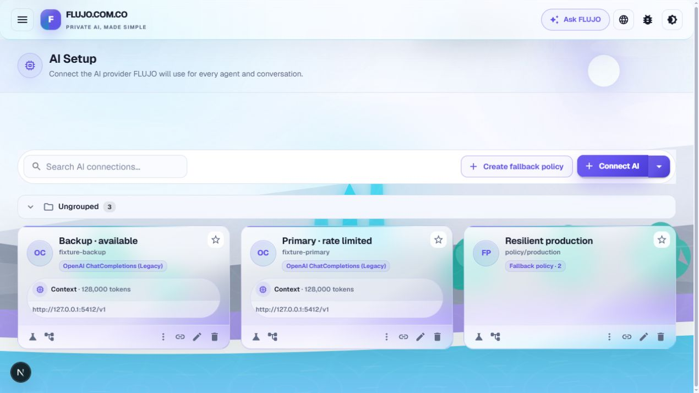
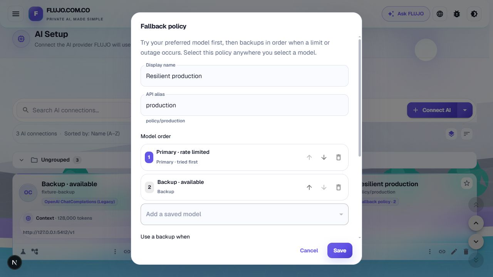
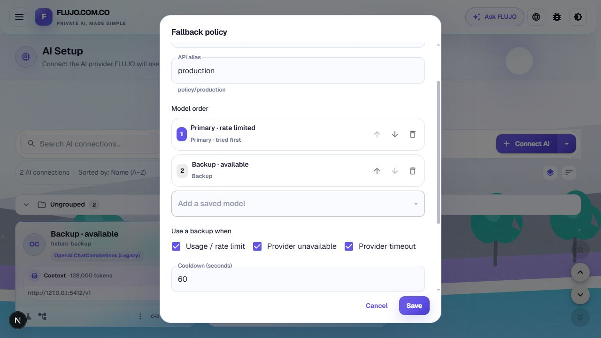

# Acceptance evidence

Captured on 2026-10-03 in an isolated FLUJO workspace against a loopback-only HTTP provider fixture. The primary returns HTTP 429; the backup returns a valid completion and supports SSE for Process execution. No paid model calls or real credentials were used.

- The policy was created through the FLUJO editor, reordered, saved, and reopened with its alias and member order intact.
- `GET /v1/models` advertises `policy/production`.
- The first direct completion fails over from the primary to the backup and reports the actual model plus a routing receipt.
- The next completion skips the primary during cooldown.
- Model CRUD rejects a missing member and deletion of a referenced member with HTTP 400.
- A quick-chat flow bound to the policy completes through the Process execution path.

See [sanitized API results](api-acceptance.json).

Local verification: production build, typecheck, scoped ESLint, API inventory, and the model/chat/workspace/MCP/scheduler/flow/UI regression suites. The Windows managed-worktree path contains `.codex`; Jest was invoked with a temporary config that normalizes test discovery globs for that path. CI uses the repository's unchanged Jest configuration.

These fixtures validate FLUJO routing and replay boundaries. They do not claim live-provider outage, distributed quota, or paid-spend acceptance.
